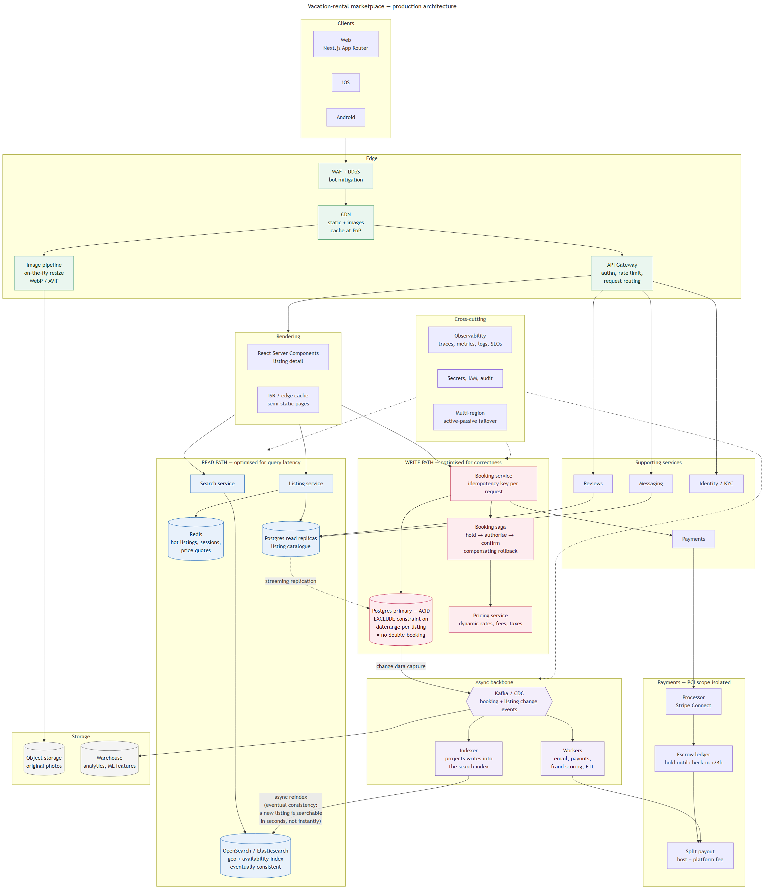

# Production architecture

Source: [`architecture.mmd`](./architecture.mmd) — regenerate with
`npx mmdc -i docs/architecture.mmd -o docs/architecture.png -w 2400 -H 1800 --backgroundColor white`

This is the design for a vacation-rental marketplace at scale, not for the clone in this
repo. The clone's own backend is four Route Handlers over a seeded JSON file
(see [`API.md`](./API.md)) — the point of that layering is that it maps onto the shape
below without being rewritten.

---

## The decision that matters: split the read path from the write path

Almost everything else follows from this.

**Search is a read problem.** "Two guests, Goa, 18–23 October, pool, under ₹6,000/night"
is a geo query with facets and availability filtering. Relational databases are bad at it
at scale — and search traffic dwarfs booking traffic by orders of magnitude.

**Booking is a correctness problem.** Two guests must never book the same night. That
needs a transaction and a real constraint, and it is a tiny fraction of the traffic.

Running both against one database means either search cripples the booking path or the
booking path's consistency requirements throttle search. So:

- **Read path** — OpenSearch/Elasticsearch holding a denormalised geo + availability
  index, fronted by Redis for hot listings and quotes, with Postgres read replicas for
  listing detail.
- **Write path** — a single Postgres primary. Double-booking is prevented by an
  **exclusion constraint on a `daterange` per listing**, so a conflicting insert *cannot*
  commit. This is deliberately not an application-level "check then insert": under
  concurrency that check is a race, and the race is exactly the failure mode that matters.
  Requests carry an **idempotency key** so a retried payment never books twice.

**The two are joined asynchronously.** Change data capture from the primary into Kafka,
an indexer projects those events into the search index. That arrow is the one candidates
usually leave out, and it carries a real cost: **a new or updated listing is searchable in
seconds, not instantly.** That is an acceptable trade for a marketplace — nobody notices a
listing appearing three seconds late; everybody notices a double booking.

## Booking as a saga

A booking spans services: hold the dates, authorise the payment, confirm, notify. A
distributed transaction across them is not available, so it runs as a saga with
compensating actions — if the payment authorisation fails, the date hold is released.
The hold is what makes the window safe.

## Payments

Funds sit in **escrow** until roughly 24 hours after check-in, then split-pay out to the
host minus platform fee. The processor (Stripe Connect or equivalent) holds card data;
**PCI scope never enters our services**, which is why payments is drawn as an isolated
box rather than another microservice with a database.

## Edge and images

Photography is the product on this kind of site and the dominant byte cost. Originals live
in object storage; the CDN fronts an **on-the-fly resize pipeline** that generates and
caches derivatives on first request in WebP/AVIF, rather than pre-generating every size
for every image. Listing pages are rendered with RSC and cached at the edge; genuinely
static pages use ISR.

## Cross-cutting

Observability (traces, metrics, logs, SLOs), secrets and IAM, rate limiting at the
gateway, multi-region active-passive failover.

## What this design deliberately does not do

- **One database for everything.** Search on the relational store is the single most
  common mistake in this exercise.
- **Synchronous everything.** Without the queue, an indexing hiccup takes bookings down.
- **Payments as one box with no note.** Escrow, split payout and PCI scope are the parts
  that carry real risk.
- **A "microservices" cloud with no data flows.** Boxes without arrows say nothing about
  ownership or consistency, which is where the actual design lives.
